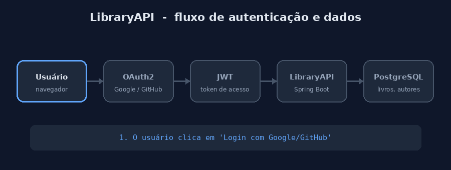

# 📚 LibraryAPI — Biblioteca Digital

Uma API RESTful desenvolvida em **Spring Boot** para gerenciar uma biblioteca digital, permitindo o cadastro, busca e gerenciamento de **livros**, **autores** e **usuários**. A API conta com um **Authorization Server OAuth2** próprio (que emite tokens **JWT**), login social via **Google e GitHub** e persistência em **PostgreSQL**.

---

## 🎬 Visão geral do fluxo



> Ilustração do fluxo: login (formulário, Google ou GitHub) → token JWT emitido pela API → requisição autenticada → persistência no PostgreSQL.

---

## 🌟 Funcionalidades principais

- Cadastro, atualização, exclusão e busca de **Livros**
- Cadastro, atualização, exclusão e busca de **Autores**
- Cadastro e gerenciamento de **Usuários**
- Login por formulário e login social com **Google** e **GitHub**
- **Authorization Server OAuth2** próprio, emitindo access tokens JWT assinados com RSA
- Proteção dos endpoints como **Resource Server** (JWT no header `Authorization`)
- Controle de acesso por permissões (`@EnableMethodSecurity`)
- Persistência de dados em **PostgreSQL**
- Documentação interativa com **Swagger UI** e monitoramento com **Actuator**

---

## 🧰 Tecnologias usadas

- Java 21 + Spring Boot 3.3
- Spring Data JPA com Hibernate
- Spring Security com OAuth2 (Client, Resource Server e Authorization Server) e JWT
- PostgreSQL
- MapStruct e Lombok
- Thymeleaf
- Spring Boot Actuator
- Springdoc OpenAPI (Swagger UI)
- Maven
- Deploy na Render

---

## 🗂️ Estrutura do projeto

```
libraryapi/
├── docs/
│   └── images/           # GIF usado no README
├── src/
│   ├── main/
│   │   ├── java/io/github/Gusta_code22/libraryapi/
│   │   │   ├── config/       # AuthorizationServerConfiguration, SecurityConfiguration
│   │   │   ├── model/        # entidades (ex.: Usuario)
│   │   │   ├── security/     # autenticação customizada, login social, filtro JWT
│   │   │   ├── service/      # regras de negócio
│   │   │   └── ...           # demais pacotes (controllers, repositórios, DTOs)
│   │   └── resources/        # application.yml e configurações
│   └── test/                 # testes
├── pom.xml                   # dependências e configuração do Maven
├── LICENSE                   # licença MIT
└── README.md
```

---

## 🚀 Como rodar localmente

### Pré-requisitos

- Java 21 instalado
- PostgreSQL rodando (local ou remoto)
- Maven instalado

### Passos

1. Clone o repositório:

```bash
   git clone https://github.com/Gusta-code22/libraryapi.git
   cd libraryapi
```

2. Configure as variáveis de ambiente criando um arquivo `.env` na raiz:

```env
   DATASOURCE_URL=jdbc:postgresql://<host>:5432/<database>
   DATASOURCE_USERNAME=<usuario>
   DATASOURCE_PASSWORD=<senha>

   GOOGLE_CLIENTID=<seu-client-id-google>
   GOOGLE_CLIENT_SECRET=<seu-secret-google>
   GITHUB_CLIENTID=<seu-client-id-github>
   GITHUB_CLIENT_SECRET=<seu-secret-github>

   SPRING_PROFILES_ACTIVE=default
```

3. Execute a aplicação:

```bash
   mvn spring-boot:run
```

4. A API estará disponível em `http://localhost:8080`.

---

## 📖 Documentação interativa (Swagger)

Com a aplicação rodando, acesse (rota pública, sem login):

```
http://localhost:8080/swagger-ui/index.html
```

O Swagger mostra todos os endpoints e os modelos de requisição/resposta.

---

## 🔐 Autenticação e autorização

A LibraryAPI é ao mesmo tempo **Authorization Server** (emite os tokens) e **Resource Server** (valida os tokens nas requisições).

### Regras de acesso

| Rota                          | Acesso                                   |
|-------------------------------|------------------------------------------|
| `/login`                      | Público                                  |
| `POST /usuarios/**`           | Público (cadastro de usuário)            |
| Swagger (`/swagger-ui/**`, `/v3/api-docs/**`) e `/actuator/**` | Público |
| Qualquer outra rota           | Exige autenticação                       |

### Formas de login

- **Formulário:** `http://localhost:8080/login`
- **Google:** `http://localhost:8080/oauth2/authorization/google`
- **GitHub:** `http://localhost:8080/oauth2/authorization/github`

Pelo navegador, depois do login a sessão fica autenticada e você já consegue acessar os endpoints protegidos.

### Como obter o token JWT

Para chamar a API fora do navegador (curl, Postman, outro sistema), o token é emitido pelo Authorization Server da própria aplicação, pelo fluxo **Authorization Code**:

1. Abra no navegador a URL de autorização e faça login (formulário, Google ou GitHub):

```
   http://localhost:8080/oauth2/authorize?response_type=code&client_id=<CLIENT_ID>&redirect_uri=<REDIRECT_URI>
```

   Após o login, você é redirecionado para a `redirect_uri` com o parâmetro `code` na URL. Não é necessário confirmar consentimento.

2. Troque o `code` pelo token:

```bash
   curl -X POST http://localhost:8080/oauth2/token \
     -u <CLIENT_ID>:<CLIENT_SECRET> \
     -d "grant_type=authorization_code" \
     -d "code=<CODE>" \
     -d "redirect_uri=<REDIRECT_URI>"
```

   > `CLIENT_ID`, `CLIENT_SECRET` e `REDIRECT_URI` são os do client cadastrado na própria aplicação (não são as credenciais do Google ou do GitHub).

3. A resposta traz o `access_token` (JWT). Ele vale por **60 minutos**, e o refresh token vale por **90 minutos**.

### Claims do token

O access token é um JWT autocontido, assinado com RSA, e inclui claims customizadas:

- `scope`: lista de permissões do usuário
- `email`: e-mail do usuário
- `provider`: origem do login (formulário, Google ou GitHub)

### Chamando a API com o token

```bash
# Listar livros
curl -H "Authorization: Bearer <SEU_TOKEN>" http://localhost:8080/livros

# Listar autores
curl -H "Authorization: Bearer <SEU_TOKEN>" http://localhost:8080/autores
```

### Endpoints do Authorization Server

| Endpoint                | Função                                      |
|-------------------------|---------------------------------------------|
| `/oauth2/authorize`     | Início do fluxo de autorização              |
| `/oauth2/token`         | Obter token                                 |
| `/oauth2/introspect`    | Consultar o status de um token              |
| `/oauth2/revoke`        | Revogar um token                            |
| `/oauth2/userinfo`      | Informações do usuário (OpenID Connect)     |
| `/oauth2/jwks`          | Chave pública para verificar a assinatura   |
| `/oauth2/logout`        | Logout (OpenID Connect)                     |

> **Observação:** o par de chaves RSA é gerado a cada inicialização. Ao reiniciar a aplicação, os tokens emitidos antes deixam de ser válidos e é preciso obter um novo.

### Endpoints principais da API

| Método | Rota        | Descrição      |
|--------|-------------|----------------|
| GET    | `/livros`   | Lista livros   |
| GET    | `/autores`  | Lista autores  |
| GET    | `/usuarios` | Lista usuários |

Os demais endpoints (criar, atualizar e excluir) e os formatos de requisição estão no Swagger.

---

## ☁️ Deploy na Render

1. Faça push do código para o GitHub.
2. Na Render, crie um **Web Service** apontando para a branch `main`.
3. Configure as mesmas variáveis de ambiente do `.env`.
4. Configure os comandos:
   - **Build:** `./mvnw clean package`
   - **Start:** `java -jar target/libraryapi-0.0.1-SNAPSHOT.jar`
5. Configure o health check no caminho `/actuator/health`.

Sua API ficará disponível em um domínio público da Render.

---

## 🔍 Como funciona o fluxo básico

1. O usuário faz login por formulário, Google ou GitHub.
2. O Authorization Server da API emite um token JWT assinado.
3. O cliente envia o token no header `Authorization: Bearer` a cada requisição.
4. A API valida o token e libera os endpoints conforme as permissões do usuário.
5. Os dados são lidos e gravados no PostgreSQL.

---

## 💡 Dicas para evoluir

- Persistir a chave RSA (variável de ambiente ou keystore) para os tokens sobreviverem a reinicializações
- Busca avançada por título, autor, categoria etc.
- Paginação e ordenação nos endpoints
- Frontend para facilitar o uso
- Testes automatizados e integração contínua

---

## 📄 Licença

Este projeto está sob a licença MIT. Veja o arquivo [LICENSE](LICENSE) para mais detalhes.

---

## ⭐ Agradecimentos

Obrigado por visitar este projeto! Se curtir, deixe uma estrela ⭐ no GitHub e compartilhe com a comunidade.
